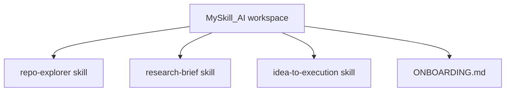

# Repository Onboarding Guide

## What this repository does

This repository currently contains three GitHub Copilot skill definitions for repository exploration, research briefs, and idea-to-execution planning. It does not currently contain an application, library, service, or executable runtime.

## Quick start

### Prerequisites

- VS Code with the repository opened as a workspace.
- GitHub Copilot support for repository skills, if you want to invoke the skill definitions.

### First useful action

Review the skill that matches the task:

- [repo-explorer skill](.github/skills/repo-explorer/SKILL.md) for architecture and onboarding documentation.
- [research-brief skill](.github/skills/research-brief/SKILL.md) for concise, citation-backed research.
- [idea-to-execution skill](.github/skills/idea-to-execution/SKILL.md) for implementation planning.

There is currently no installation, build, test, lint, format, or deployment command because no package manifest, source tree, test suite, or automation configuration is present.

## Repository map

| Path | Purpose |
| --- | --- |
| `.github/skills/repo-explorer/SKILL.md` | Instructions for producing a repository architecture and onboarding guide. |
| `.github/skills/research-brief/SKILL.md` | Instructions for producing a focused research brief with citations. |
| `.github/skills/idea-to-execution/SKILL.md` | Instructions for turning an idea into an implementation plan. |
| `ONBOARDING.md` | This repository onboarding guide. |

## Architecture

The repository is currently a documentation and agent-instruction collection. Its only identifiable boundary is between the three independent skill definitions; there are no runtime components, data stores, integrations, or request-processing paths to trace.

## Key workflows

### Using a skill

1. Open the relevant `SKILL.md` file.
2. Follow its workflow and output contract.
3. Ground the result in repository evidence when the task concerns a codebase.

### Development, testing, and deployment

No repository-defined development, test, build, or deployment workflow exists yet. These workflows should be added when executable project code is introduced.

## Configuration and integrations

No environment variables, configuration files, external services, databases, queues, APIs, authentication systems, or deployment integrations were found.

The skills may be used by an agent environment that supports repository skills, but that host capability is external to this repository and is not configured here.

## Where to make changes

- Update repository exploration behavior in `.github/skills/repo-explorer/SKILL.md`.
- Update research methodology or citation requirements in `.github/skills/research-brief/SKILL.md`.
- Update planning behavior or validation requirements in `.github/skills/idea-to-execution/SKILL.md`.
- Update contributor-facing repository context in `ONBOARDING.md`.

There are no implementation modules or tests to update at this time.

## Troubleshooting

### A skill does not appear to run

Confirm that the workspace is opened at the repository root and that the expected file exists under `.github/skills/<skill-name>/SKILL.md`. The front matter must include the matching `name` and a non-empty `description`.

### A generated guide includes unsupported details

The repository has no runtime or dependency metadata today. Treat claims about frameworks, commands, integrations, or deployment as unsupported unless new repository files provide evidence.

### There is no command to run

That is expected for the current repository state. Add the relevant project manifest and source files before defining installation or execution commands.

## Open questions

- What executable project, if any, will these skills support?
- Should the repository add automated validation for skill front matter and Markdown content?
- Which agent host or editor integration is expected to discover and invoke these skills?
- What contribution and release workflow should be used when project code is added?
